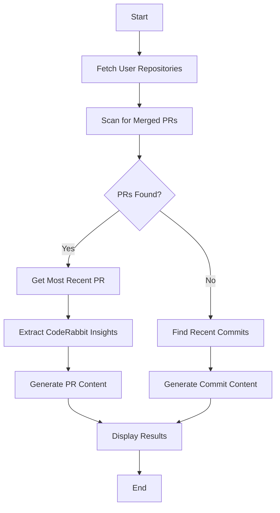

# Twitter & LinkedIn PR Poster

🤖 **Automated Social Media Content Generation for Your GitHub Projects**

Turn your GitHub pull requests and commits into engaging LinkedIn posts and Twitter content using AI. This Python tool automatically fetches your latest merged PRs, analyzes CodeRabbit AI reviews, and generates professional social media content to showcase your development work.

## 🌟 Features

- **GitHub Integration**: Automatically fetches merged PRs and recent commits from your public repositories
- **AI-Powered Content Generation**: Uses Anthropic's Claude API to create engaging, professional content
- **CodeRabbit Analysis**: Extracts and incorporates CodeRabbit AI code review insights into posts
- **Multi-Platform**: Generates optimized content for both LinkedIn (professional) and Twitter (concise)
- **Smart Fallback**: Falls back to recent commits when no merged PRs are found
- **Comprehensive Coverage**: Analyzes PR details, comments, reviews, and code changes

## 🚀 Quick Start

### Prerequisites

- Python 3.13+
- GitHub account with public repositories
- Anthropic API key
- (Optional) CodeRabbit AI integration on your repositories

### Installation

1. **Clone the repository**
   ```bash
   git clone https://github.com/yourusername/twitter-linkedin-pr-poster.git
   cd twitter-linkedin-pr-poster
   ```

2. **Set up environment**
   ```bash
   # Install dependencies using uv (recommended)
   uv sync

   # Or using pip
   pip install -r requirements.txt
   ```

3. **Configure environment variables**
   ```bash
   cp .env.example .env
   ```

   Edit `.env` and add your credentials:
   ```env
TWITTER_API_KEY=
TWITTER_API_KEY_SECRET=
TWITTER_BEARER_TOKEN=
TWITTER_ACCESS_TOKEN=
TWITTER_ACCESS_TOKEN_SECRET=
ANTHROPIC_API_KEY=
LINKEDIN_CLIENT_ID=
LINKEDIN_PRIMARY_CLIENT_SECRET=
OPENAI_API_KEY=
GEMINI_API_KEY=
GITHUB_TOKEN=
GITHUB_USERNAME=
   ```

### Getting API Keys

#### GitHub Token
1. Go to GitHub Settings → Developer settings → Personal access tokens
2. Generate a new token with `public_repo` access
3. Copy the token to your `.env` file

#### Anthropic API Key
1. Visit [Anthropic Console](https://console.anthropic.com/)
2. Create an account and navigate to API keys
3. Generate a new API key
4. Copy the key to your `.env` file

## 📖 Usage

### Basic Usage

Run the tool to automatically find your most recent activity and generate content:

```bash
python main.py
```

The tool will:
1. 🔍 Scan all your public repositories
2. 📋 Find the most recently merged PR
3. 🤖 Extract CodeRabbit insights (if available)
4. ✍️ Generate LinkedIn and Twitter content
5. 📱 Display the results for you to copy and use

### Example Output

```
GENERATED CONTENT
============================================================

LINKEDIN POST:
--------------------------------------------
🚀 Just merged a significant update to my twitter-linkedin-pr-poster project!

Implemented comprehensive GitHub API integration with intelligent PR scanning across all repositories. The system now automatically finds the most recent merged PRs and falls back gracefully to recent commits when needed.

Key improvements:
✅ Multi-repository scanning
✅ CodeRabbit AI review integration
✅ Smart content generation
✅ Enhanced error handling

This AI-powered tool helps developers showcase their work by automatically generating professional LinkedIn posts and Twitter content from their GitHub activity. CodeRabbit insights ensure high code quality!

#OpenSource #Python #AI #GitHub #Development #CodeReview

TWITTER POST:
--------------------------------------------
🎉 New release! Enhanced my GitHub→Social Media tool with multi-repo PR scanning & CodeRabbit AI integration. Now automatically finds your latest merged PRs and generates professional content!

#OpenSource #Python #AI #GitHub #CodeReview

🔗 github.com/yourusername/twitter-linkedin-pr-poster
============================================================
```

## 🏗️ Architecture

### Core Components

#### GitHubClient
Handles all GitHub API interactions:
- `get_user_repos()`: Fetches all public repositories
- `get_recent_merged_prs()`: Retrieves recently merged PRs
- `get_pr_details()`: Gets detailed PR information
- `get_pr_comments()`: Collects all PR comments and reviews
- `extract_coderabbit_insights()`: Parses CodeRabbit AI review data

#### ContentGenerator
AI-powered content creation using Anthropic's Claude:
- `generate_linkedin_post()`: Creates professional LinkedIn content
- `generate_tweet()`: Generates concise Twitter posts
- `generate_commit_*()`: Fallback content generation for commits

### Workflow



### API Integrations

- **GitHub API v3**: Repository and pull request data
- **Anthropic Claude API**: AI content generation
- **CodeRabbit Integration**: Automated code review insights

## 🛠️ Development

### Setup Development Environment

```bash
# Install dependencies with dev tools
uv sync --dev

# Run code formatting and linting
ruff check .
ruff format .

# Fix auto-fixable issues
ruff check --fix .
```

### Project Structure

```
twitter-linkedin-pr-poster/
├── main.py              # Main application entry point
├── pyproject.toml       # Project configuration and dependencies
├── uv.lock             # Locked dependency versions
├── .env.example        # Environment variables template
├── .gitignore          # Git ignore rules
├── CLAUDE.md           # Development guidelines
└── README.md           # This file
```
